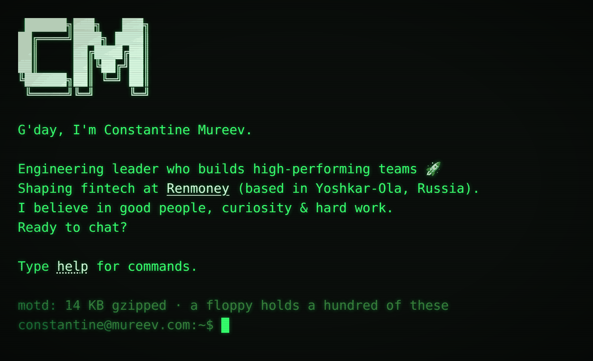

### Hey, I'm Constantine.

A human being 😉 leading engineering teams at Renmoney.

I believe in good people, curiosity & hard work.

Have a good day!

--  
Constantine Mureev  
[mureev.com](https://mureev.com/)

---

## This repo is [mureev.com](https://mureev.com)

[](https://github.com/mureev/mureev/actions/workflows/ci.yml)
[](https://github.com/mureev/mureev/actions/workflows/production.yml)

My personal site. It's a terminal — not a page in a terminal costume, a
login session. Type `help`. You were going to anyway.

```
constantine@mureev.com:~$ whoami
constantine
uid=2009(constantine) gid=42(engineering) groups=fintech,payments,mobile,teams,coffee
```



### Why a terminal

The obvious objection to a personal site that pretends to be a terminal is
that it's a gimmick, and the 2017 version was one: jQuery Terminal, 300 KB
of other people's JavaScript doing an impression of a shell. It was a fine
joke as long as nobody opened the Network tab. The 2026 version is the same
joke taken seriously. History walks the way readline walks it, with the
half-typed line kept and given back. Tab completes, and lists when it
can't. `^C` prints `^C`. A paste runs line by line. The motd prints where a
login prints it, and `uptime` has load averages. None of this means
anything to someone who has never used a terminal, which is the point.
It's a handshake, and a handshake has to be done right.

The whole thing is one file, 14 KB gzipped, one round trip. There is no
build step, so what View Source shows is the file in this repo, byte for
byte. It has eleven commands and five themes; the list of what it doesn't
have is longer, and was argued over harder. The size, the one file and the
live site are checked by tests every morning, which is the only mention
the tests will get here.

I direct, agents build. [AGENTS.md](AGENTS.md) is the contract they work
to; the tests hold the parts of it a machine can check. There's a
[`/llms.txt`](content/llms.txt) for the agents that come crawling.

### Run it

```sh
open content/index.html        # that's the whole dev environment
```

Or the way production does:

```sh
docker build -t mureev.com . && docker run -p 8080:80 mureev.com
```

### Release

Push to `master` — that is the deploy. CI runs the suites, builds the image
once, tests it (a smoke test, then the e2e suite against the container) and
publishes that image to GHCR as `ghcr.io/mureev/mureev.com`, from a job that
runs no npm code and is the only one holding a token that can deploy. The
server picks up the new build within a couple of minutes, health-checks it,
and rolls back if the check fails. The CVs live on the server, not in this
repo: production mounts them.

### Test it

```sh
npm ci                             # Playwright, the only devDependency
npx playwright install chromium    # once: the browser the e2e suite drives
npm test                           # unit (headless core, zero-dep runner) + e2e (real Chromium)
E2E_URL=http://127.0.0.1:8080/ npm run test:e2e   # e2e against the running image: headers, caching, errors
E2E_URL=https://mureev.com/ npm run test:e2e      # the live site, as the daily check runs it
```

The unit suite slices the engine's pure core out of `index.html` by its
`@core` markers and runs it with no DOM at all; the e2e suite boots the real
page in Chromium and types at it like a visitor would — including
keyboard-only use, what a screen reader is told, a mobile viewport and a
JavaScript-disabled pass.

### Map

| Path | What |
| --- | --- |
| `content/index.html` | the site — markup, styles, and the `csh` engine |
| `content/404.html`, `50x.html` | error pages, self-contained, zero JS |
| `content/llms.txt` | briefing for AI agents |
| `content/index.txt` | what `curl mureev.com` gets: the session, as text |
| `content/.well-known/security.txt` | where to report a vulnerability ([RFC 9116](https://www.rfc-editor.org/rfc/rfc9116)) |
| `conf/` | nginx, and the response headers (note the X-Clacks-Overhead) |
| `test/` | unit + e2e suites |
| `.github/workflows/ci.yml` | the suites, then the image's smoke test and e2e, on every push; publishes that image from `master` |
| `.github/workflows/production.yml` | daily: the live site — certificates, the proxy's headers, the CVs — through the same e2e suite |
| `tools/` | generators for `og.png` and the favicons |
| `AGENTS.md` / `CLAUDE.md` | the contract for whoever builds next |

### License

Code — the `csh` engine, tests, tools, nginx and Docker config — is
[MIT](LICENSE). The personal content — biography and site copy, the CVs the
site links to, `og.png` and the favicon artwork — is © Constantine Mureev,
all rights reserved.

GNU Terry Pratchett.
